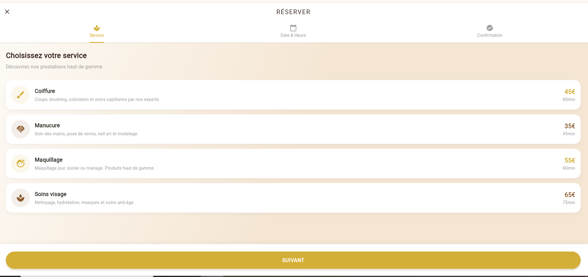
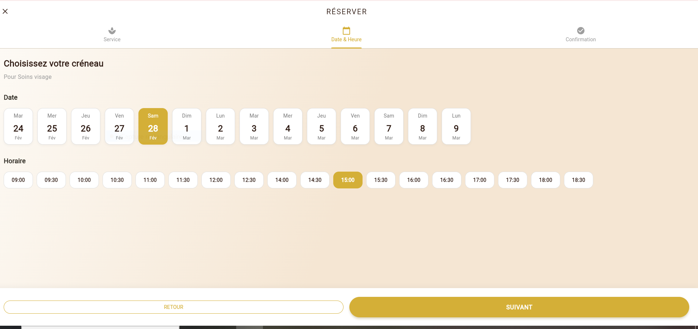
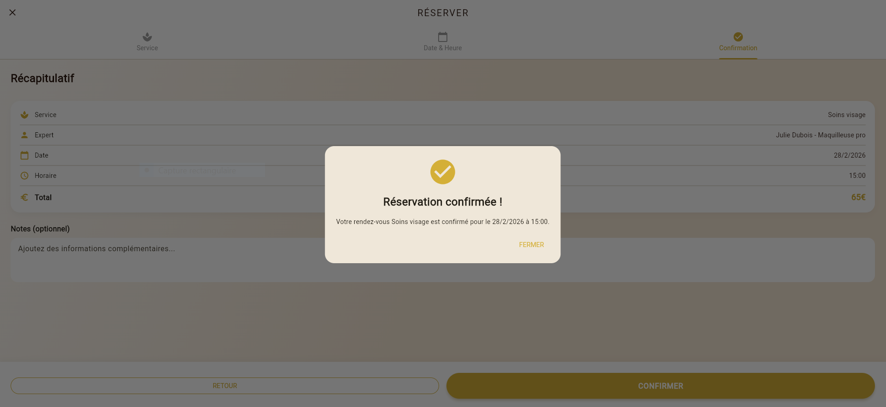
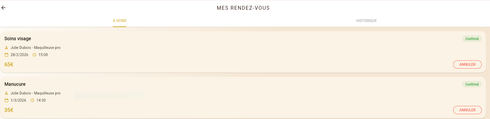
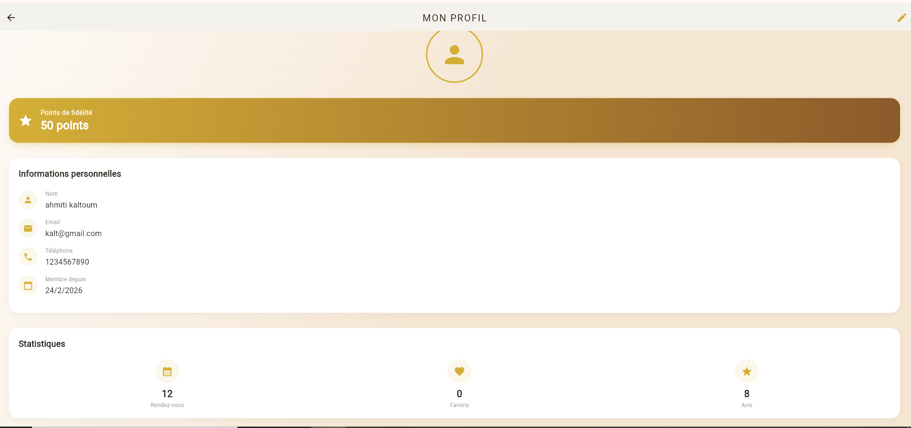
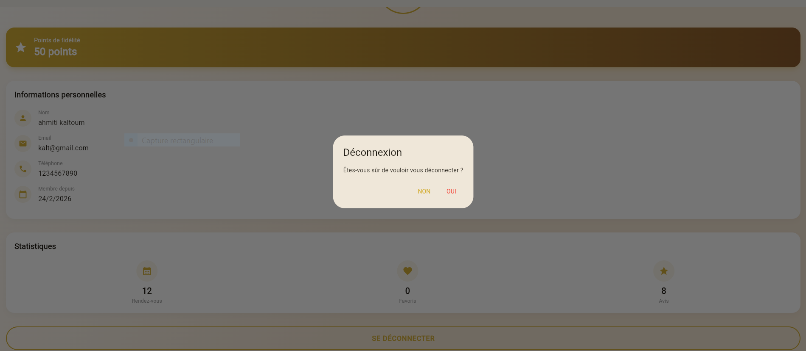
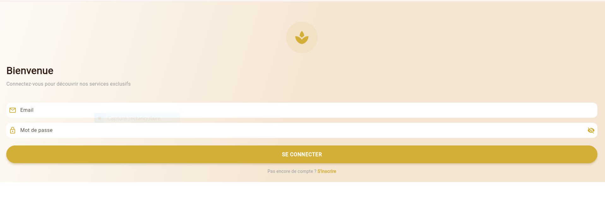
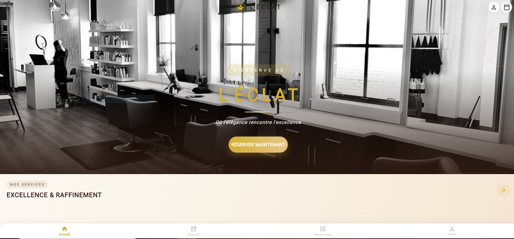
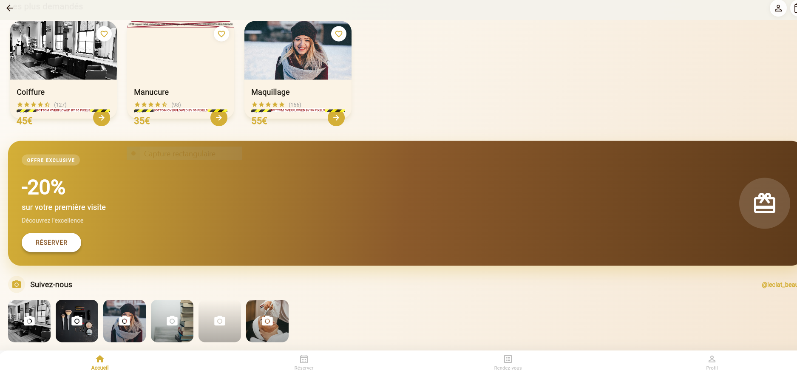

# 💇‍♀️ Salon App — Flutter

Application mobile moderne de réservation pour salon de beauté développée avec **Flutter**.  
Cette application permet aux utilisateurs de consulter les services, réserver des rendez-vous et gérer leur profil facilement.

---

## ✨ Fonctionnalités

- Authentification utilisateur  
- Consultation des services  
- Réservation de rendez-vous  
- Liste des rendez-vous  
- Profil utilisateur  
- Interface élégante et moderne  
- Animations fluides  

---

## 📱 Captures d’écran

### 🏠 Accueil & Interface principale


### 🗓️ Réservation




### 💇‍♀️ Services & Détails




### 👤 Profil & Options



---

## 🛠️ Technologies utilisées

- Flutter  
- Dart  
- Material Design  
- Animations Flutter  

---

## 🚀 Installation

```bash
git clone https://github.com/ahmiti/salon_app_flutter.git
cd salon_app_flutter
flutter pub get
flutter run
